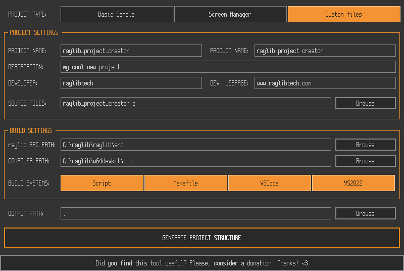

## `raylib project creator`

Welcome to `raylib project creator`! The new tool to help you setup professional raylib projects!

When starting with raylib is common to create a simple .c code file in some directory and jump directly into coding, the `raylib Windows Installer` package already provides a pre-configured environment to do it that way; the compiler, the Npp editor and raylib library are already pre-configured to do so.

But as soon as a project starts growing, usually more complex project structures are required. Usually a build system for multiple code files, external libraries, project assets/resources, configuration files, executable icons and even some automatized CI/CD system. Configuring all those aspects usually requires a lot of time.

`raylib project creator` is a visual tool to simplify that process and automatically create and pre-configure some common build systems for a project, just providing an input source code file to start with.

#### _DISCLAIMER_

Note that a project could be really complex in terms of source files, external dependencies, resources and build configurations. `raylib project creator` does not pretend to support all possible options but the minimum ones to quickly generate a working project structure to be directly uploaded to GitHub and start working on a bigger project.

### Build Systems

`raylib project creators` generates the following project build systems:

 - **Scripts** [`projects/scripts/build.bat`]: Command-line build scripts, for Windows `CMD` (`build.bat`) _-CHECK LIMITATIONS BELOW-_
 - **Makefile** [`src/Makefile`]: The default and recommended raylib build system, preconfigured for multiple platforms (Windows, Linux, FreeBSD, macOS, WebAssembly).
 - **VS2022** [`projects/VS2022/*`]: Visual Studio 2022 complete solution (.sln). The generated solution contains raylib sources to be build along the project, in case it needs to be debugged or customized for the project needs. It also includes multiple build configurations and preconfigured output paths for better organization. All build happens to `projects/VS2022/build` directory.
 - **VSCode** [`projects/VSCode/*`]: Visual Studio Code preconfigured tasks and settings for the project._-CHECK LIMITATIONS BELOW-_
 - **GitHub Actions** [`.github/workflows/*`]: GitHub Actions workflows preconfigured to compile the project on multiple platforms (Windows, Linux, macOS, WebAssembly). Windows workflow use `projects/VS2022` for building while Linux/macOS/WebAssembly use `src/Makefile` for project building. Note that those workflows are setup to automatically run and upload generated files to on new GitHub project `Release` creation. They can also be run manually.

### Limitations

Current version has some limitations:

 - Script generated is currently Windows only (`build.bat`) and it calls the `src/Makefile` build system. A possible improvement for the future is calling directly the required process. Also, supporting some other shell would be nice.
 - VSCode project requires the compiler and tools available in the system path; it also calls the `src/Makefile` build system. It would be nice to make it more self-contained.

### License

This project sources are licensed under an unmodified zlib/libpng license, which is an OSI-certified, BSD-like license that allows static linking with closed source software. Check [LICENSE](LICENSE) for further details.

*Copyright (c) 2024 Ramon Santamaria (@raysan5)*
